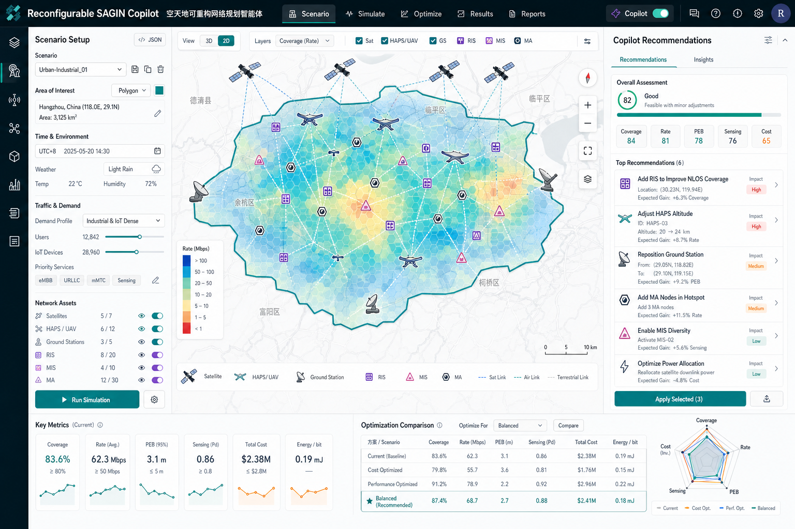

# Design System Notes

Reference concept:



## Product Surface

The first screen is the actual planning tool, not a landing page.

Primary regions:

- dark top command bar,
- left scenario setup panel,
- central digital-twin canvas,
- right Copilot recommendations panel,
- bottom metric and comparison strip.

## Tokens

```text
background: #eef3f5
surface: #ffffff
surface-muted: #f6f9fa
ink: #12202a
muted: #647482
border: #dce5e8
nav: #041923
teal: #008f8f
cyan: #2aaec5
blue: #1f6ed4
amber: #f39a1e
magenta: #d9468d
violet: #7c4dff
success: #10a66a
danger: #d94d4d
```

## Interface Rules

- Use the map/canvas as the dominant element.
- Keep controls compact and readable.
- Use icons for repeated tools and node types.
- Avoid nested cards and decorative blobs.
- Keep engineering density without making text tiny.
- Keep all labels code-native so the UI remains interactive and localizable.

