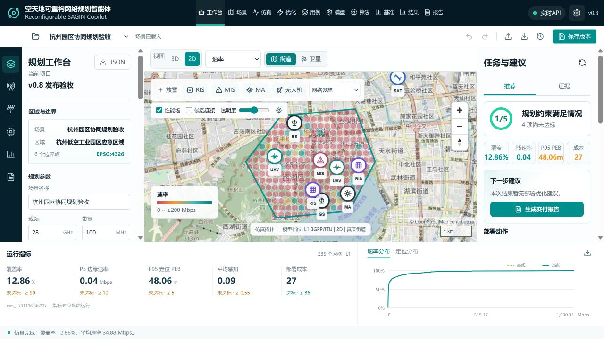
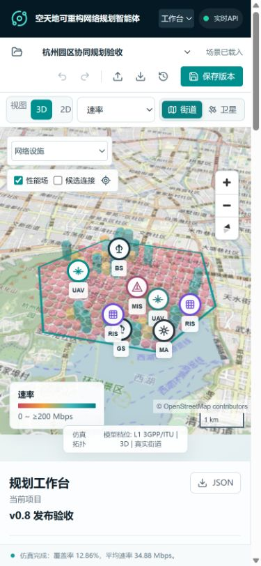

# v0.8 发布验收记录

日期：2026-10-05。以下区分实际检查与未验证能力。

## 本地检查

- Python 核心与 API 完整测试：25 项通过；之后对快照、任务、报告绑定的补充修改，重跑 API 4 项通过。
- TypeScript 检查和 Vite 生产构建通过。MapLibre 独立包仍大于 500 kB，构建会提示体积警告。
- 浏览器实际完成：创建验收项目、复制场景、修改参数、撤销、保存版本、L1 仿真、NSGA-II 部署优化、WMMSE 资源分配、中文报告生成。
- NSGA-II 界面验收使用种群 8、代数 2、种子 321；WMMSE 使用 8 条流、4 次迭代。这是功能验收，不是论文数值复现或收敛证明。
- 密集场景采用 20 x 16 网格，区域内有效单元 235 个。L1 运行显示覆盖 12.86%、P5 速率 0.04 Mbps、P95 PEB 48.06 m；界面如实显示未达标项。
- 桌面截图 1280 x 720；手机目标视口 390 x 844，检查时文档宽度未超过视口。图中地图、资产标记、图例和控件已实际渲染。
- 地图区二维/三维截图像素标准差约 38-42，模式切换的平均绝对像素差约 27-29，结合人工截图检查确认不是空白画布或仅修改按钮文字。
- 验收修复了：旧优化指标混入当前工作台、移动端旧网格样式导致控件重叠，以及瓦片加载期间 `isStyleLoaded` 门控造成的三维切换丢失。

截图：

这些是实际界面，不是概念设计。三维柱体表达性能数值，不代表真实建筑物。

## 部署检查

本机未安装 Docker，因此不把本机容器部署记为已验证。仓库配置 GitHub Actions，在 Linux 上执行核心测试、前端构建、Docker Compose 启动、同源健康检查、L1 仿真和运行记录读取。

每次提交的独立执行结果见 [GitHub Actions](https://github.com/zhengziyuan/reconfigurable-sagin-copilot/actions)。部署的成功依据是对应提交的容器检查通过，不是 Dockerfile 存在。

## 不在本次验收结论内

真实外场精度、3GPP 全量一致性、Sionna RT、轨道时序、建筑/地形传播、并发多租户、公网安全、商业地图服务 SLA、完整论文图表复现均未验证。边界与后续工程要求见 [产品审计](09_v08_product_audit.md)。
